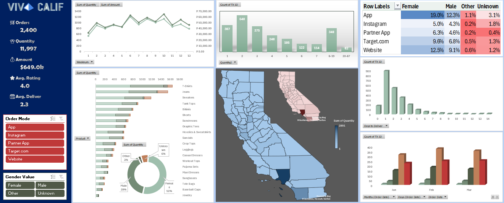

# 📊 Viva Calif - Sales & Order Analytics Dashboard
An Interactive Advanced Excel Dashboard designed to analyze e-commerce order metrics, sales revenue, product performance, customer demographics, and fulfillment efficiency.
---
## 📸 Dashboard Preview

---
## 🔑 Key Performance Indicators (KPIs)
* **Total Orders:** 2,400 orders across multiple sales channels.
* **Total Quantity Sold:** 11,997 units.
* **Total Revenue:** $649.0K generated.
* **Average Customer Rating:** 4.0 / 5.0.
* **Average Delivery Time:** 2.3 days.
---
## 📈 Dashboard Insights & Visualizations
* **Order Channels:** Mobile App leads as the top channel (19% female, 12.3% male engagement), followed by Website and Target.com.
* **Demographic Split:** Female customers represent the largest buyer segment (52%), followed by Male buyers (39%).
* **Product Demand:** T-Shirts, Jeans, and Sneakers generated the highest sales quantity.
* **Geographic Distribution:** Map visual highlights peak order concentration across California regions.
* **Fulfillment Speed:** The majority of orders were delivered within 1 to 3 days.
---
## 🛠️ Tools & Excel Techniques Used
* Pivot Tables & Pivot Charts
* Dynamic Slicers (Order Mode, Gender Filtering)
* Conditional Formatting & Heatmaps
* Custom KPI Card Visuals & Map Visualizations
* Data Cleaning & Aggregation Functions
---
## 🚀 How to View the Project
1. Download or clone this repository:
   ```bash
   git clone [https://github.com/svvdainsights-gif/viva-calif-sales-analytics-excel.git](https://github.com/YOUR-USERNAME/viva-calif-sales-analytics-excel.git)
